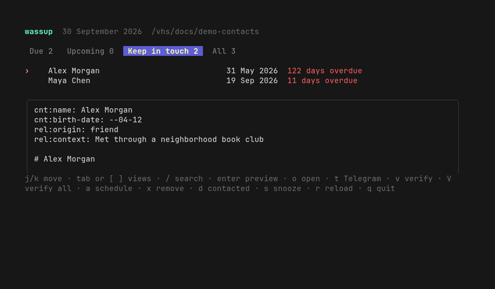

# wassup

[](https://github.com/volard/wassup/actions/workflows/release.yml)
[](https://go.dev/)
[](LICENSE)

A local TUI that reminds you who you have not spoken to lately—without moving
your contact notes out of Markdown.



Markdown remains the source of truth. Wassup validates contact metadata and
only changes its three scheduling fields.

## Quick start

Install the latest Linux release (`amd64` or `arm64`):

```sh
curl -fsSL https://raw.githubusercontent.com/volard/wassup/main/install.sh | sh
```

The installer verifies the release checksum and writes to
`~/.local/bin/wassup`. Use `INSTALL_DIR` for another destination,
`VERSION=v1.2.3` for a specific release, or `GH_TOKEN` when authentication is
required.

Point Wassup at your contact notes on first run:

```sh
wassup --contacts /path/to/contacts
```

The path is saved in `~/.config/wassup/config.json`; later runs need only
`wassup`.

### Build from source

Requires Go 1.24 or newer:

```sh
make build
./build/wassup --contacts /path/to/contacts
```

Build output stays in the ignored `build/` directory.

## Contact notes

Each contact is a Markdown file with frontmatter:

```yaml
---
cnt:name: Alex Morgan
cnt:last-contact: 2026-08-28
cnt:contact-every-days: 90
cnt:snooze-until: 2026-09-15
---
```

`cnt:contact-every-days` schedules a contact. Without it, the note remains in
**All** but not **Keep in touch**. A scheduled contact without
`cnt:last-contact` is due today. Dates use the local timezone; birth dates also
accept `--MM-DD` when the year is unknown.

Use `wassup --check` to validate every note without opening the TUI.

## Configuration

The generated config contains every supported setting and frontmatter mapping:

- `contacts_dir`: directory containing contact notes
- `start_view`: `due`, `upcoming`, `keep_in_touch`, or `all`
- `opener.command`: argument array used by `o`; must contain `{path}`
- `frontmatter_fields`: contact keys and allowed relationship origins
- `notifications`: reminder time, suggestion limit, and notification command

Commands are executed directly, not through a shell. Relative `contacts_dir`
paths resolve from the config directory. `--config` selects another config;
`--contacts` and `WASSUP_CONTACTS` temporarily override its contact path.
Precedence is CLI → environment → config.

## Optional notifications

Notifications require Linux, a systemd user session, and `notify-send`. The TUI
itself does not require systemd.

```sh
wassup --install-notifications
```

This installs a persistent daily user timer—no server or background Wassup
process. Run `wassup --notify` to trigger the check manually. Successful sends
are recorded once per local day to avoid duplicates.

## Keys

| Key | Action |
| --- | --- |
| `j`, `k`, arrows | Move |
| `tab`, `]` / `shift+tab`, `[` | Next / previous view |
| `/` | Search names and notes |
| `enter` | Toggle preview |
| `o` | Open the selected note |
| `a` | Set the contact interval |
| `x` | Remove from Keep in touch |
| `d` | Set last-contacted date; blank means today |
| `s` | Snooze |
| `r` | Reload notes |
| `esc` | Close preview or clear search |
| `q` | Quit |

The preview starts open and moves beside the list on terminals at least 100
columns wide. Removing a contact from **Keep in touch** preserves the note and
last-contact date; only the interval and snooze are removed.

## File safety

- Updates use a temporary file and atomic rename.
- Unrelated frontmatter, Markdown content, permissions, and line endings are
  preserved.
- Invalid notes are skipped with a warning; valid notes continue to load.
- Malformed or unknown config values are reported instead of overwritten.
